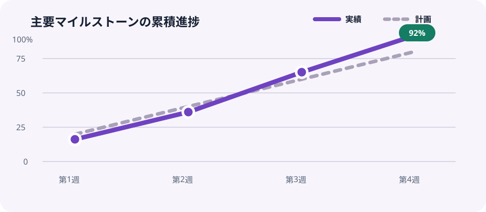

<header class="report-hero">
  
Kiri Lab / Monthly Activity Report

  <h1>活動実績レポート</h1>
  
2026年7月 · プロダクト開発と運用改善

</header>

今月は配布可能なレンダリング基盤の安定化を優先し，主要マイルストーンの<strong>92%</strong>を予定どおり完了しました．利用者テストの所見を次期計画へ反映し，品質ゲートも自動化しています．

<section class="kpi-grid" aria-label="主要指標">
  <article class="kpi-card">
完了タスク

24

+18% 前月比
</article>
  <article class="kpi-card">
リリース頻度

週 2.3

目標 週 2.0
</article>
  <article class="kpi-card">
重大障害

0

3か月連続
</article>
</section>

<aside class="callout">
<strong>要点：</strong>描画品質と再現性の改善が定着し，次月は配布・導入フローの短縮へ投資できます．
</aside>

## 月間進捗

<figure><figcaption>図1．主要マイルストーンの累積進捗（計画値と実績値）</figcaption></figure>

実績値は第3週から計画値を上回りました．テスト自動化を先行したことで，第4週の統合作業を並行化できたことが主因です．

## デリバリー状況

| 施策 | 成果 | 状態 | 次の判定 |
| --- | --- | --- | --- |
| レンダリング安定化 | 主要経路の回帰テストを追加 | 完了 | 継続監視 |
| 配布パイプライン | 署名・成果物検証を設計 | 進行中 | 8月第1週 |
| 利用者テスト | 5件の代表シナリオを実施 | 完了 | 所見を反映 |
| Windows検証 | ブラウザ探索を自動化 | 要観察 | 実機 smoke |

### 品質所見

- HTML，PDF，スライドの基調色と文字階層を同じトークンで統一しました．
- ローカル資産だけで生成できるため，オフライン環境でも再現できます．
- 表，グラフ，KPIを同じ情報密度で比較できる構成にしました．

## 次月の重点

<ol>
  <li><strong>配布：</strong>バージョンと更新手順を利用者向けに固定する．</li>
  <li><strong>品質：</strong>Windows実機でPDF生成の smoke test を完了する．</li>
  <li><strong>体験：</strong>フォーマット選択から出力までの操作を短縮する．</li>
</ol>

